<!-- AWAKEN:START -->
<!-- Generated by git-profile-awaken. Edit awaken.json instead of this block. -->







<a href="https://github.com/minhtrong67/my-tauri-desktop-apps"></a>
<a href="https://github.com/minhtrong67/my-extension-pack"></a>

<a href="https://github.com/minhtrong67/my-terminal-tool-pack"></a>




<!-- AWAKEN:END -->
